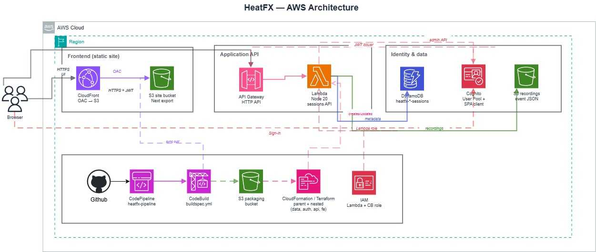

# HeatFX

Serverless web app that records mouse interactions on a grid (up to 60s for signed-in users, shorter for guests), then shows a **heatmap** and **replay**.

## Local dev

```bash
npm install
npm run dev
```

Open [http://localhost:3000](http://localhost:3000). Changes are picked up automatically.

- **Recording**: Start → countdown → move/click/drag in the grid → Stop (or auto-stop at the cap). Then **View results**.
- **Results**: Heatmap, Replay, and Details tabs.

### How recording data is stored

- **Durable storage (logged-in users)**: When you save a recording, the app **POSTs** the full event payload to the **HTTP API**. The backend writes **metadata to DynamoDB** and the event JSON (**including setting snapshots and chaos-mode data**) to a **private S3 bucket**. **My Recordings** lists sessions from the API and loads event data via a **presigned S3 URL**.
- **`sessionStorage`**: Used only as a **same-tab bridge** so the Results page can read the payload immediately after recording or after you open a session from **My Recordings** (the app fetches from S3, then caches the assembled result in `sessionStorage` for that tab). It is **not** the system of record; clearing site data or using another device does not affect cloud copies.
- **Guests**: You can record and view results in that session without logging in; those results are **not** saved to the cloud until you sign in and save.

To point the app at a deployed backend while developing, copy **`.env.example`** → **`.env.local`** and set **`NEXT_PUBLIC_*`** from your infra outputs (API URL, Cognito pool, client, domain, redirect URI). Set **`NEXT_PUBLIC_API_URL`** with **no trailing slash** (the client builds paths like `/api/sessions`). See **[infra/README.md](infra/README.md)**.

## Stack

- **Frontend**: Next.js 14 (App Router), TypeScript, **`output: 'export'`** static site for **S3 + CloudFront**.
- **Backend**: API Gateway **HTTP API**, **Lambda** (Node 20), **DynamoDB** (session index), **S3** (recording payloads), **Cognito** (auth + Hosted UI).

**Infrastructure (pick one per environment):**

- **CloudFormation / SAM** — templates under **`infra/cloudformation/`**; **`aws cloudformation package`** uploads nested templates and Lambda, then a **parent stack** deploys data, auth, API, and frontend. Scripts: **`scripts/deploy-aws.sh`** / **`scripts/deploy-aws.ps1`**. Optional **CodePipeline** + **`buildspec.yml`** for GitHub → deploy (separate stack under **`infra/cloudformation/pipeline/`**).
- **Terraform** — same logical architecture under **`infra/terraform/`** (modules + **`infra/terraform/api`** Lambda source). Optional **GitHub → CodePipeline** for Terraform + frontend build lives in **`infra/terraform/pipeline/`** with **`buildspec.terraform.yml`**. See **[infra/terraform/README.md](infra/terraform/README.md)**.

Do **not** manage the same environment with both tools at once. Details and parameters: **[infra/README.md](infra/README.md)**.

## Architecture diagram

High-level **HeatFX serverless architecture** on AWS (browser, static frontend, HTTP API + Lambda, Cognito, DynamoDB, S3, and optional CI/CD):



## Implementation status

| Area | Status |
|------|--------|
| Next.js UI (grid, record/pause/stop, countdown) | Done |
| Event capture (normalized coords, sampling, drag rect, scroll, chaos mode) | Done |
| Backend: save session (`POST /api/sessions`), list, get (presigned URL), delete | Done |
| Results: load from `sessionStorage` handoff or from API + S3 via **My Recordings** | Done |
| Heatmap / Replay / Details tabs | Done |
| Cognito auth, **My Recordings**, admin flows (where implemented) | Done |
| CloudFormation parent + nested stacks + infra docs | Done |
| Terraform mirror + docs | Done |
| CI/CD for Terraform (`infra/terraform/pipeline/`, `buildspec.terraform.yml`) | Documented in **[infra/terraform/README.md](infra/terraform/README.md)** — pipeline stack + GitHub connection |

## Build (static export for S3 / CloudFront)

```bash
npm run build
```

Output is **`out/`**. To smoke-test the static files locally: **`npm run preview`** (serves **`out/`** on port 3000). Sync to the **site bucket** from CloudFormation or Terraform outputs, then **invalidate CloudFront** (see **[infra/README.md](infra/README.md)**).

## Deploy to AWS (summary)

1. Configure the AWS CLI (e.g. SSO profile).
2. **CloudFormation**: follow **[infra/README.md](infra/README.md)** or run **`scripts/deploy-aws.sh`** / **`deploy-aws.ps1`** with **`PACKAGING_BUCKET`**, **`COGNITO_DOMAIN_PREFIX`**, etc.
3. **Terraform**: follow **[infra/terraform/README.md](infra/terraform/README.md)** — full steps from a **GitHub clone** to **CloudFront** (CodePipeline path or laptop-only). Short version: **`npm ci`** in **`infra/terraform/api`**, **`terraform.tfvars`**, **`terraform apply`**, then **`npm run build`** + **`aws s3 sync out/`** + invalidation (or let **`buildspec.terraform.yml`** do that in CI).

After deploy, set **`NEXT_PUBLIC_*`** in **`.env.local`** (or your host’s env) from stack/terraform **outputs** for a working auth + API connection.
